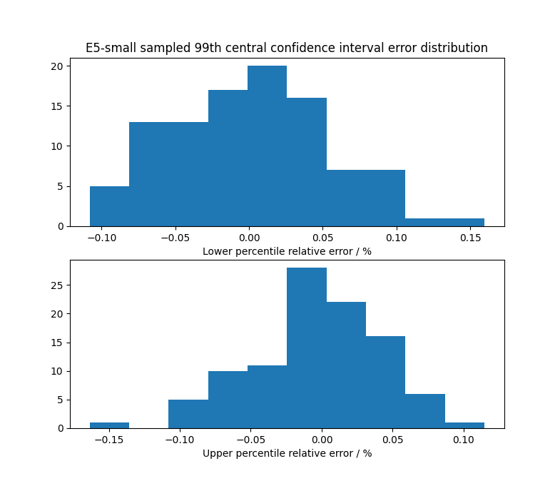
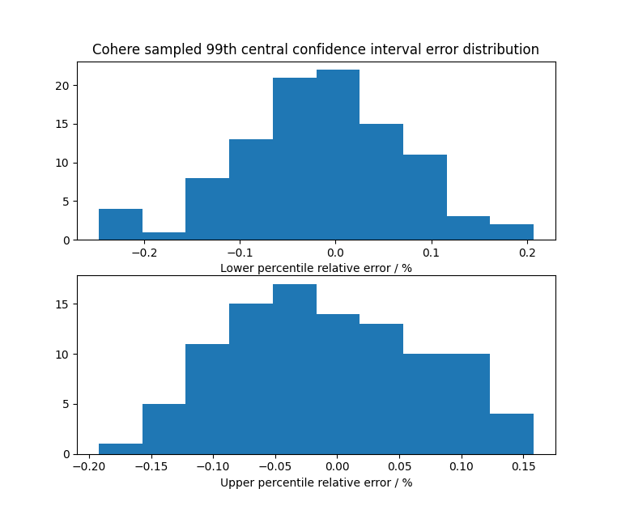
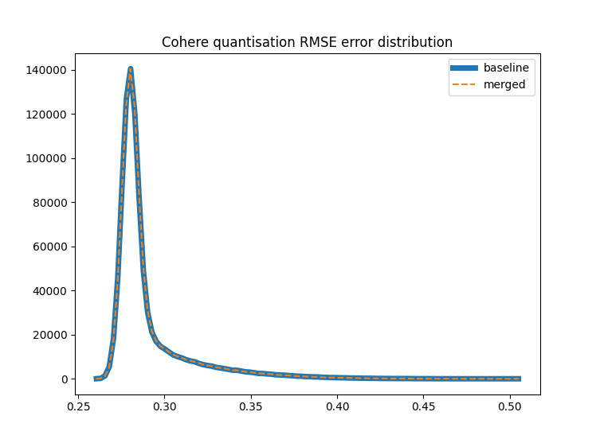

## Setup

Run experiments merging linear quantisation parameters from the root directory.
The functionality can be imported as follows: 
```
>>> from src.linear_merge import *
```

## Quantiles

First of all we show that for 25k random samples there is almost no difference in the
quantiles computed.

We use E5-small (embeddings of quora passages) and Cohere (embeddings of wiki passages)
for our tests. The full data sets are ~500k and ~900k, respectively.

We generate 100 random samples of 25k vectors then plot relative error in the lower
and upper ends of the 99th percentile central confidence. The maximum error is 0.15%
for E5-small and 0.2% for Cohere. The error distributions are as follows:





In the following, we always use at most 25k samples to compute the percentiles used
to clip components for linear quantisation.

## Quantisation

Linear quantisation to 8 bits is computed as follows:
$$
  x_q = q(x;l,u) = \left[\frac{256 (clip(x, l, u) - l)}{u - l}\right]
$$
where the subtraction is broadcast over the vector $x$, $l$ and $u$ are upper and
lower quantiles, in the following we use 0.005 and 0.995, i.e. the 99th percentile
central confidence interval, the $clip$ function truncates componentwise to
the interval $[l, u]$ and $[\cdot]$ denotes round to the nearest integer. The
inverse operation, or dequantise, is
$$
  x_d = d(x;l,u) = l + \frac{(u - l) x_q}{256}
$$


In the following we explore how best to merge segments which contain different 
quantisation parameters $\{(l_i, u_i)\}$. The basic requirements is to minimise the
number of times we need to
1. Recompute quantiles ($l$ and $u$)
2. Requantise the vectors

Requantising vectors requires us to load every vector dequantise it using the old
quantiles and then requantise using the new quantiles. In general, if segments
contain random samples of the full dataset then, as per the discussion above, we
expect their quantiles to be very similar. Specifically, $l_i \thickapprox l_j$ 
and $u_i \thickapprox u_j$ for $i \neq j$. However, in adversarial for example if
different segments contain disjoint regions vector space we need to be able to
detect a problem and requantise.

We explore two criteria based on the definition of quantisation operation. Provided
$|l_n - l_o| < \epsilon$ and $|l_n - u_o| < \epsilon$ for some small $\epsilon$
then
$$
   q(d(x;l_o,u_o);l_n,u_n) \thickapprox q(d(x;l_o,u_o);l_o,u_o)
$$

In such cases there is no point in requantising since the result will be no more
accurate than retaining the current quantised vectors. We can deduce what $\epsilon$
is in such a case based on the definition of quantisation. In particular, if
$\epsilon \ll \frac{u - l}{256}$ then we do not expect $q(d(x;l_o,u_o);l_n,u_n)$
to change actuall many values in the quantised vector. Roughly speaking we expect
the dequantised values to be uniformly distributed on any of the 256 subdivisions
of $[l,u]$. In practice, we found $\epsilon = \frac{0.2 (u - l)}{256}$, was sufficient
to ensure that the error introduced by retaining the original vectors and updating
the quantiles had almost no effect.

In order to compute the quantile efficiently we use a weighted mean of the values
from each segment where the weight is proportional to the count of vectors in
the segment. This is to ensure that if any segment is very small the estimate is
close to the large segment (which will be accurate) and so we will not bother to
requantise its vectors. Specifically, the new quantiles are defined as
$$
  l_m = \frac{\sum_i{ |X_i| l_i }}{\sum_i{ |X_i| }}
$$
and
$$
  u_m = \frac{\sum_i{ |X_i| u_i }}{\sum_i{ |X_i| }}
$$
Our criterion is we do not requantise vectors for a given segment if
$$
  |l_i - l_m| < \frac{0.2 (u_m - l_m)}{256} \text{ and } |u_i - u_m| < \frac{0.2 (u_m - l_m)}{256}
$$

The figures below show the RMSE error distributions between the raw vectors
and quantised vectors for a merge of four random segments. The data for these
were generated as follows:
```python
>>> import numpy as np
>>> from src.linear_merge import *
>>> x = read_fvecs("data/corpus-quora-E5-small.fvec")
>>> partition = [0] + [i for i in np.random.choice(x.shape[0], 3)] + [x.shape[0]]
>>> partition.sort()
>>> x_p = random_partition(x, partition)
>>> x_ = np.concatenate(x_p, axis=0)
>>> q_p = [central_confidence_interval(sample(x), 0.99) for x in x_p]
>>> x_p_q = quantise_all(x_p, q_p)
>>> x_m_q, q_m, r = merge_quantisation(x_p_q, q_p)
>>> x_m = dequantise(x_m_q, q_m[0], q_m[1])
>>> x_p = np.concatenate(dequantise_all(x_p_q, q_p), axis=0)
>>> c_m, e_m = np.histogram(compute_quantisation_rmse(x_, x_m), bins=100)
>>> c_p, e_p = np.histogram(compute_quantisation_rmse(x_, x_p), bins=100)
```
Observe that the baseline uses the per segment quantiles to dequantise while
the merged uses the weighted average of the segment quantiles. The decision
for whether to requantise using the vectors was based on the criterion above.
In this example no segments were requantised.


