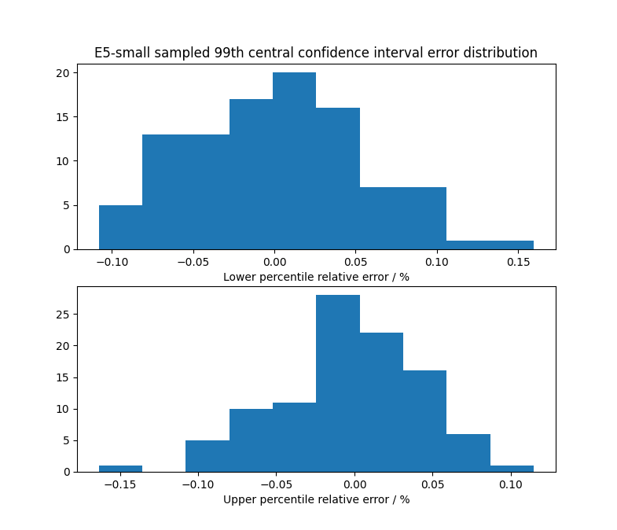
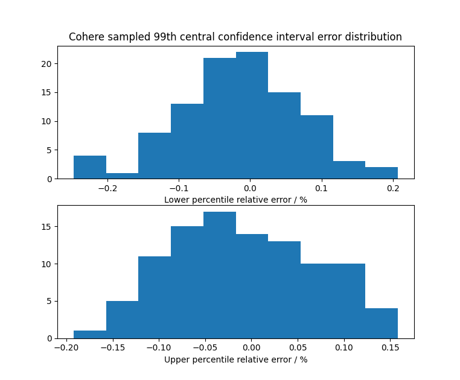
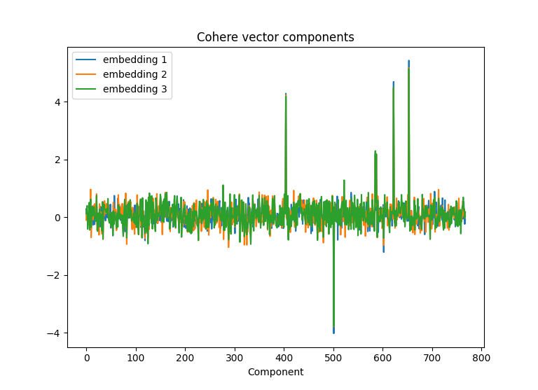
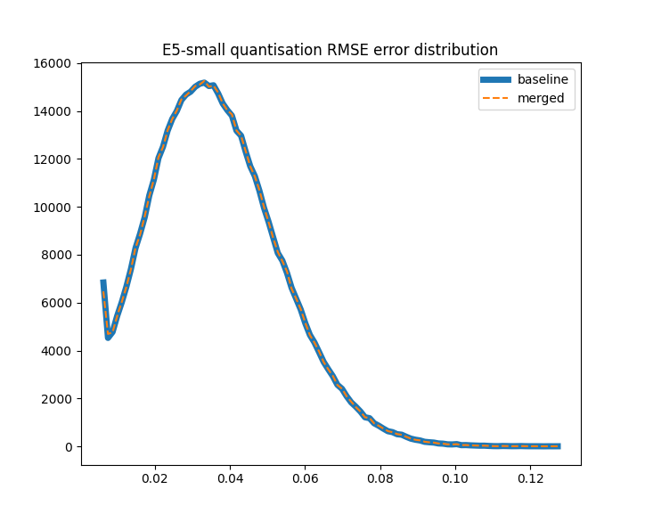
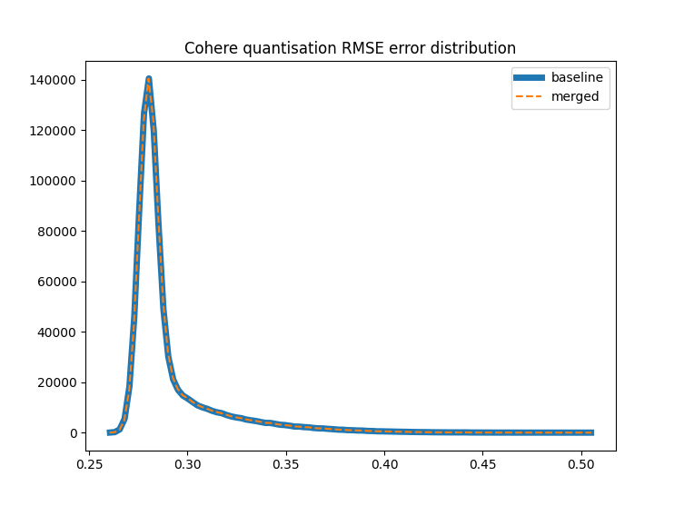
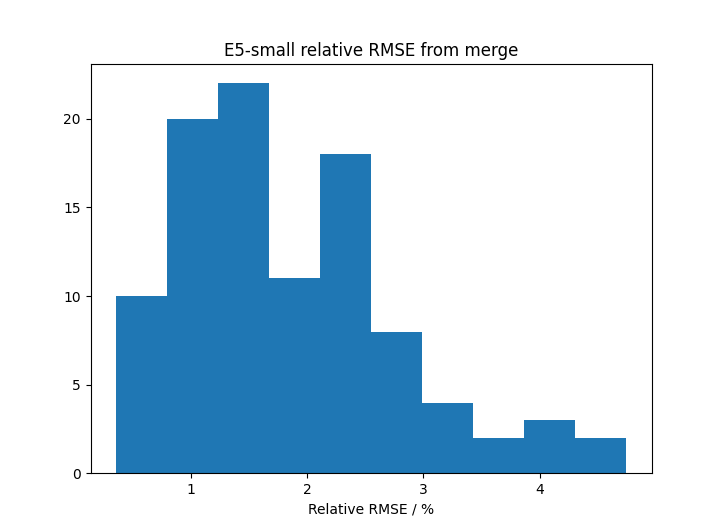
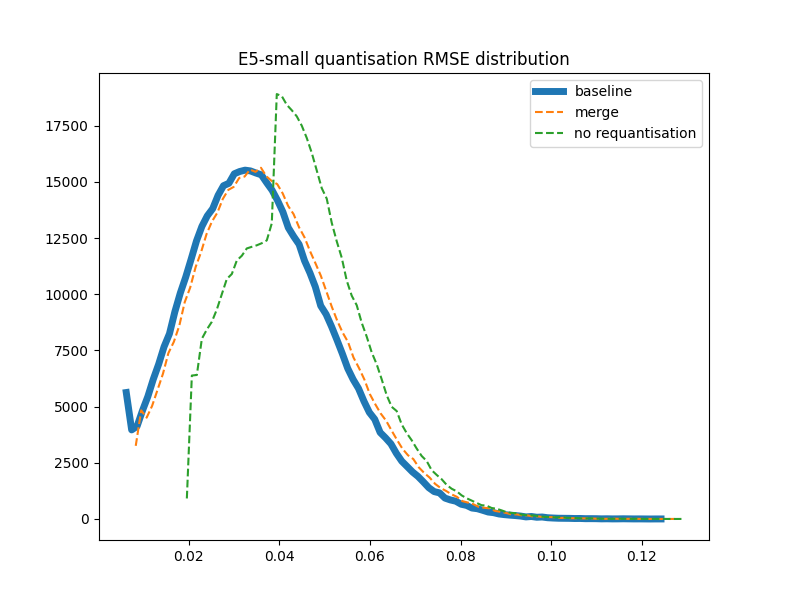
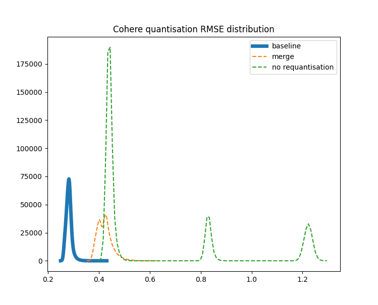
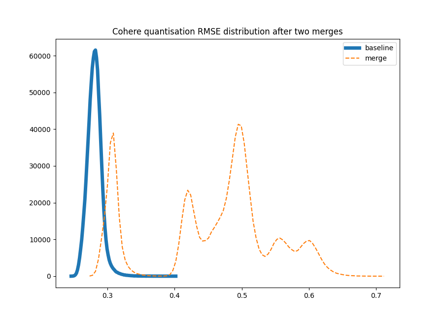
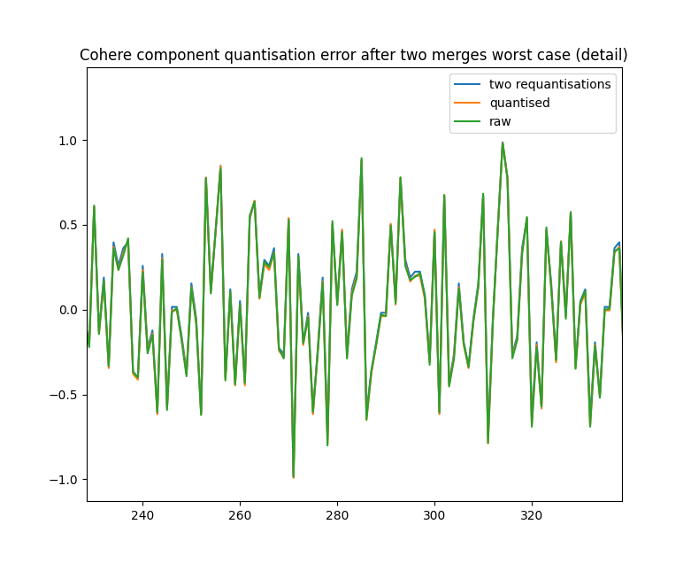

## Setup

Run experiments merging linear quantisation parameters from the root directory.
The functionality can be imported as follows: 
```
>>> from src.linear_merge import *
```

## Quantiles

First of all we show that for 25k random samples there is almost no difference in the
quantiles computed.

We use E5-small (embeddings of quora passages) and Cohere (embeddings of wiki passages)
for our tests. The full data sets are ~500k and ~900k, respectively.

We generate 100 random samples of 25k vectors then plot relative error in the lower
and upper ends of the 99th percentile central confidence. The maximum error is 0.15%
for E5-small and 0.2% for Cohere. The error distributions are as follows:





In the following, we always use at most 25k samples to compute the percentiles used
to clip components for linear quantisation.

## Scalar Quantisation

Linear quantisation to 8 bits is computed as follows:
```math
  \vec{x}_q = q(\vec{x};l,u) = \left[\frac{256 (clip(\vec{x}, l, u) - l)}{u - l}\right]
```
where the subtraction is broadcast over the vector $\vec{x}$, $l$ and $u$ are upper and
lower quantiles (in the following we use central confidence intervals), the $clip$
function truncates componentwise to the interval $[l, u]$ and $[\cdot]$ denotes
round to the nearest integer. The inverse operation, or dequantise, is
```math
  \vec{x}_d = d(\vec{x};l,u) = l + \frac{(u - l) \vec{x}_q}{256}
```
It is important to choose the confidence interval large enough such that no single
outlying component is clipped if they are not close in magnitude. A sufficient
condition for this is to use $CI > 1 - 1/d$ where $d$ is the vector dimension.
The Cohere embeddings have exactly this property as per the figure below.



## Distance Calculation

We would like to take advantage of the performance benefit of performing the distance
calculation on quantised vectors. In this section we discuss how to achieve this and
simultaneously improve accuracy w.r.t. first dequantising vectors.

First we discuss the dot product, which also covers cosine as well since it is equivalent
if we  normalise vectors. The similarity of a query and document embedding is defined as
follows
```math
  \text{sim}(\vec{q}, \vec{d}\:)
    = \vec{q}^{\:t} \vec{d}
    = (\vec{l} + \vec{q} - \vec{l}\:)^t (\vec{l} + \vec{d} - \vec{l}\:)
```
where we denote $l\vec{1}$ as $\vec{l}$. Expanding out we have
```math
  \text{sim}(\vec{q}, \vec{d}\:)
    = l^2 \text{dim} + \vec{l}^{\:t} (\vec{q} - \vec{l} + \vec{d} - \vec{l}\:) +
      (\vec{q} - \vec{l}\:)^t (\vec{d} - \vec{l}\:)
```
So far we have retained all quantities in full precision. As before, for scalar quantisation
we replace the vector $\vec{d} - \vec{l}$ by a compressed representation where we scale
and round to the nearest integer. In particular, define
$\vec{x}_q = \frac{u-l}{256}\left[\frac{256}{u-l}(\vec{x} - \vec{l})\right]$.

Now the first two terms only depend on the document and query so we can precompute them.
So focusing on the last term we have
```math
  (\vec{q} - \vec{l}\:)^t (\vec{d} - \vec{l}\:)
    = (\vec{q}_q + (\vec{q} - \vec{l} - \vec{q}_q))^t (\vec{d}_q + (\vec{d} - \vec{l} - \vec{d}_q))
```
We expect $\vec{\epsilon}_q = (\vec{q} - \vec{l} - \vec{q}_q)$ and $\vec{\epsilon}_d = (\vec{d} - \vec{l} - \vec{d}_q)$
to be small compared to the leading term. So expanding gives
```math
  (\vec{q} - \vec{l}\:)^t (\vec{d} - \vec{l}\:)
    = \vec{q}_q^{\:t} \vec{d}_q + \vec{\epsilon}_q^{\:t} \vec{d}_q + \vec{\epsilon}_d^{\:t} \vec{q}_q + O(\|\vec{\epsilon}\|^{\:2})
```
We only want to retain one scalar per vector (or we lose the space benefit).
However, we don't know a priori the $\vec{q}_q$ and $\vec{d}_q$ for which we will
compute similarity. We consider two options:
1. Use the expectation of the vectors over the query and document distribution,
2. Use vectors parallel to the query and document vectors. This is similar to the
rationale for anisotropic loss for product quantisation: parallel vectors are expected
to be nearest neighbours and we want the best accuracy for them.

For case 1 we have that $`\vec{\epsilon}_q^{\:t} \vec{d}_q = \vec{\epsilon}_q^{\:t} \mathbb{E}_{\vec{d}}[\vec{d}-\vec{l}\:]`$
and $`\vec{\epsilon}_d^{\:t} \vec{q}_q =\vec{\epsilon}_d^{\:t} \mathbb{E}_{\vec{q}}[\vec{q}-\vec{l}\:]`$
These can be approximated by $`\vec{\epsilon}_q^{\:t} \frac{1}{|D|}\sum_{\vec{d} \in D}{\vec{d}-\vec{l}}`$
and $`\vec{\epsilon}_d^{\:t} \frac{1}{|Q|}\sum_{\vec{q} \in Q}{\vec{q}-\vec{l}}`$, respectively,
where $D$ and $Q$ are samples of the documents and queries. In practice, one likely
doesn't know $Q$ in which case it is typical to use $D$ for both.

For case 2 we would simply use $`\vec{\epsilon}_q^{\:t} \vec{d}_q = \vec{\epsilon}_q^{\:t}(\vec{q}-\vec{l})`$
and $`\vec{\epsilon}_d^{\:t}\vec{q}_q = \vec{\epsilon}_d^{\:t}(\vec{d}-\vec{l})`$.

## Merging Segment Scalar Quantisation

### Randomly Distributed Vectors

In the following we explore how best to merge segments which contain different 
quantisation parameters $\{(l_i, u_i)\}$. The basic requirements is to minimise the
number of times we need to
1. Recompute quantiles ($l$ and $u$)
2. Requantise the vectors

Requantising vectors requires us to load every vector dequantise it using the old
quantiles and then requantise using the new quantiles. In general, if segments
contain random samples of the full dataset then, as per the discussion above, we
expect their quantiles to be very similar. Specifically, $l_i \thickapprox l_j$ 
and $u_i \thickapprox u_j$ for $i \neq j$. However, in adversarial cases, such as
if different segments contain disjoint regions of vector space, we need to be able
to detect we need to requantise. We explore two criteria to achieve this.

Provided $|l_n - l_o| < \epsilon$ and $|u_n - u_o| < \epsilon$ for some small
$\epsilon$ then
```math
   d(q(\vec{x};l_o,u_o);l_n,u_n) \thickapprox d(q(\vec{x};l_o,u_o);l_o,u_o)
```

In such cases there is no point in requantising since the result will be no more
accurate than retaining the current quantised vectors. We can deduce the largest
$\epsilon$ for which this is the case based on the definition of quantisation.
In particular, if $\epsilon \ll \frac{u_n - l_n}{256}$ then we do not expect
$q(d(\vec{x};l_o,u_o);l_n,u_n)$ to change many values in the quantised vector. Roughly
speaking we expect the dequantised values to be uniformly distributed on any of
the 256 subdivisions of $[l_n,u_n]$ which implies the probability that a component
will change in requantisation is $\epsilon / \frac{u - l}{256}$. In practice, we
found $\epsilon = \frac{0.2 (u - l)}{256}$, was sufficient to ensure that the
error introduced by retaining the original quantised vectors and only updating
the quantiles had almost no effect.

In order to compute the quantiles efficiently we use a weighted mean of the values
from each segment. The weight is proportional to the count of vectors in the segment.
This is to ensure that if any segment is very small the estimate is close to the
large segments (which will be accurate) and so we will not requantise them. Specifically,
the new quantiles are defined as
```math
  l_m = \frac{\sum_i{ |\{\vec{x}_i\}| l_i }}{\sum_i{ |\{\vec{x}_i\}| }}
```
and
```math
  u_m = \frac{\sum_i{ |\{\vec{x}_i\}| u_i }}{\sum_i{ |\{\vec{x}_i\}| }}
```
The criterion to choose to retain the original quantised vectors for a given
segment is
```math
  |l_i - l_m| < \frac{0.2 (u_m - l_m)}{256} \text{ and } |u_i - u_m| < \frac{0.2 (u_m - l_m)}{256}
```

The figures below show the RMSE distributions between the raw vectors and
quantised vectors for a merge of four random segments.





The data for these were generated as follows:
```python
>>> import numpy as np
>>> from src.linear_merge import *
>>> x = read_fvecs("data/corpus-quora-E5-small.fvec")
>>> partition = [0] + [i for i in np.random.choice(x.shape[0], 3)] + [x.shape[0]]
>>> partition.sort()
>>> x_p = random_partition(x, partition)
>>> x_ = np.concatenate(x_p, axis=0)
>>> q_p = [central_confidence_interval(sample(x), 0.99) for x in x_p]
>>> x_p_q = quantise_all(x_p, q_p)
>>> x_m_q, q_m, r = merge_quantisation(x_p_q, q_p)
>>> x_m = dequantise(x_m_q, q_m[0], q_m[1])
>>> x_p = np.concatenate(dequantise_all(x_p_q, q_p), axis=0)
>>> c_m, e_m = np.histogram(compute_quantisation_rmse(x_, x_m), bins=100)
>>> c_p, e_p = np.histogram(compute_quantisation_rmse(x_, x_p), bins=100)
```
Observe that the "baseline" uses the per segment quantiles to dequantise while
"merged" uses the weighted average of the segment quantiles. The decision
for whether to requantise was based on the criterion above. In this example
no segments were requantised.

The figure below shows relative RMSE for 100 random between the quantised
vectors (before and after merge) and between the quantised and raw vectors.
Specifically, we compute for 100 different random partitions
```math
\frac{\sum_{i,j}{\|d(q(\vec{x}_{i,j};l_i,u_i);l_m,u_m)-d(q(\vec{x}_{i,j};l_i,u_i);l_i,u_i)\|}}{\sum_{i,j}{\|\vec{x}_{i,j}-d(q(\vec{x}_{i,j};l_i,u_i);l_i,u_i)\|}}
```
The maximum relative error for E5-small embeddings introduced by merge was 4%. In
practice, this is essentially no different to the varition we see when we recompute
quantisation from scratch on the merged segments. On average only 1% of vectors
needed to be requantised and worst case only 15% of vectors were requantised in
any single merge.



The decision to recompute quantiles rather than use the weighted average uses the
same form of test, but a different value for $\epsilon$. It was sufficient to only
recompute quantiles in the case that $\epsilon>\frac{u_m-l_m}{32}$: this dealt with
all adversarial cases we discuss below. If any segment's quantile error is greater
than this we recomputed quantiles using 25k random samples. We sample each segment
in proportion to its count. In particular we sample a segment
```math
\left\lceil\frac{25000 |\{\vec{x}_i\}|}{\sum_i|\{\vec{x}_i\}|}\right\rceil
```
times.

### Adversarily Distributed Vectors

We explored two adversarial cases:
1. For dot product (Cohere) vectors were sorted prior to partitioning,
2. For cosine (E5-small) vectors were clustered by k-means to generate
   partitions.

The top figure below shows the RMSE distribution in the case the segments
correspond to distinct clusters of the E5-small embeddings. The bottom
figure shows the RMSE distribution in the case the vectors are sorted by
length for Cohere embeddings. In both cases the condition identifies the
need to requantise all segments. Without requantisation, the green dashed
line, the RMSE is significantly higher so as expected it is important
to detect and handle this case.





Running this 100 times the test detects the need to requantise every segment
every time. The RMSE is at most 7% larger and on average 5% larger after merge.

The lower figure suggests quantisation errors can accumulate if one is forced
to repeatedly requantise. It seems reasonable that quantisation errors from
each merge would be independent. In which circumstances we expect components
to perform a random walk with step size equal to half the quantisation interval,
i.e. $\frac{u-l}{256}$. So the error distribution would eventually settle to mean
zero normal with variance proportional equal to
```math
0.25 \times \text{number merges} \times (\text{quantisation interval})^2
```
In Lucene the number of merges is small since there is a maximum segment size
is limited. Also as we can see from the bottom figure the component errors are
tiny even with multiple rounds of requantisation. So in practice this shouldn't
be a problem.





# Multichannel Quantisation

TODO
